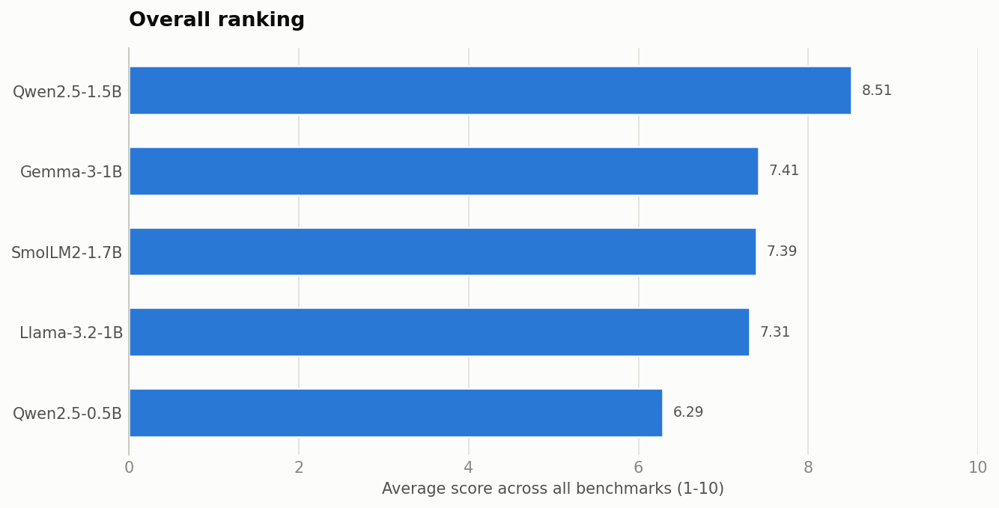
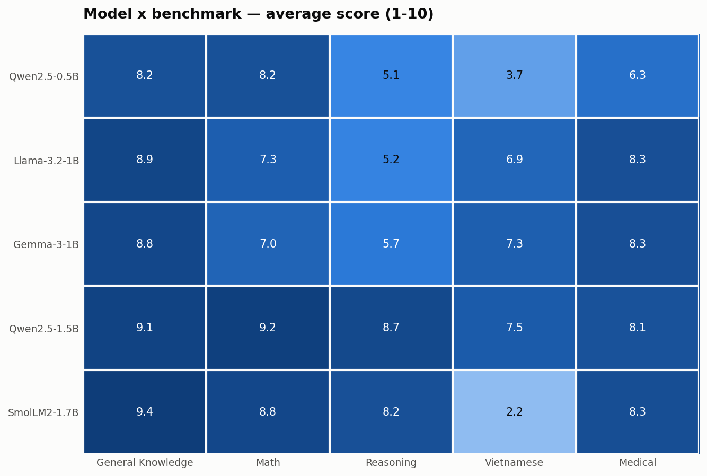

# Báo cáo benchmark: 5 model nhỏ (≤2B) trên 5 benchmark

**Setup:** 5 model (0.5B–1.7B, Q4 qua Ollama) × 5 benchmark × 6 câu hỏi mở = 150 câu trả lời, chấm bởi judge **Qwen2.5-14B** theo 3 tiêu chí/benchmark, thang 1–10, chạy trên Lambda A10. Toàn bộ 25 cặp hoàn thành 100%, không có lỗi call nào (18/18 điểm hợp lệ mỗi cặp).

## Kết quả tổng

| # | Model | Điểm TB | Nhận xét một dòng |
|---|-------|---------|-------------------|
| 1 | **Qwen2.5-1.5B** | **8.51** | Đều nhất ở mọi benchmark, không có điểm yếu nào |
| 2 | Gemma-3-1B | 7.41 | Cân bằng tốt nhất nhóm 1B, tiếng Việt khá |
| 3 | SmolLM2-1.7B | 7.39 | Nhất 3/5 bảng tiếng Anh nhưng **sập hoàn toàn tiếng Việt** |
| 4 | Llama-3.2-1B | 7.31 | Kiến thức + y khoa tốt, lập luận yếu |
| 5 | Qwen2.5-0.5B | 6.29 | Trả giá rõ rệt cho kích thước 0.5B |

### Ma trận model × benchmark (điểm trung bình 1–10)

| Model | General Knowledge | Math | Reasoning | Vietnamese | Medical |
|---|---|---|---|---|---|
| Qwen2.5-0.5B | 8.17 | 8.17 | 5.11 | 3.72 | 6.28 |
| Llama-3.2-1B | 8.89 | 7.33 | 5.17 | 6.89 | 8.28 |
| Gemma-3-1B | 8.78 | 7.00 | 5.72 | 7.28 | 8.28 |
| Qwen2.5-1.5B | 9.06 | **9.22** | **8.67** | **7.50** | 8.11 |
| SmolLM2-1.7B | **9.44** | 8.78 | 8.22 | 2.17 | **8.33** |

## 5 phát hiện chính

### 1. Qwen2.5-1.5B là lựa chọn đa dụng tốt nhất

Không thắng tuyệt đối bảng nào ngoài Math và Reasoning, nhưng là model **duy nhất không có điểm dưới 7.5** ở bất kỳ benchmark nào. Ở bộ Reasoning bẫy — nơi mọi model ≤1B đều rớt — nó giải đúng cả bat-and-ball ($0.05), "all but 9" (9 con cừu), bài 100 máy/100 sản phẩm (5 phút) và giải thích đúng nghịch lý đồng đô la bị mất.

### 2. SmolLM2-1.7B: giỏi tiếng Anh nhất, nhưng cấm dùng cho tiếng Việt

Điểm General Knowledge 9.44 là ô cao nhất toàn bảng, Medical cũng đứng đầu. Nhưng với tiếng Việt, model **suy sụp ở mức độ nghiêm trọng hơn cả "kém"**: khi được hỏi "tại sao trời có màu xanh", nó rơi vào vòng lặp thoái hóa sinh ra **80 dòng lặp lại nguyên văn** "Pháp hóa (Phosphorus)… Năng động (Living Energy)…" vô nghĩa; giải thích tục ngữ "Có công mài sắt" thành "nếu bạn có máy hướng vào sắt, thì bạn cũng có tặc trưởng". Judge cho trung bình 2.17/10 — hoàn toàn xứng đáng. SmolLM2 được huấn luyện gần như thuần tiếng Anh, và benchmark này phơi bày điều đó.

### 3. Tiếng Việt là trục phân hóa mạnh nhất (2.17 → 7.50)

Không benchmark nào tách các model xa nhau như tiếng Việt. Bất ngờ thú vị: **Gemma-3-1B (7.28) và Llama-3.2-1B (6.89) vượt xa Qwen2.5-0.5B (3.72)** dù Qwen nổi tiếng đa ngôn ngữ — ở cỡ 0.5B, không có "tiếng Việt tử tế" cho bất kỳ họ model nào. Gemma-3 hưởng lợi rõ từ dữ liệu đa ngôn ngữ của thế hệ mới.

### 4. Suy luận bẫy: ranh giới nằm giữa 1B và 1.5B

Ba model ≤1B đều rớt Reasoning (5.11–5.72) theo cùng một kiểu — trả lời trôi chảy nhưng sai logic:

- Llama-3.2-1B: "all but 9 run away" → làm phép 17 − 9 = **8** (sai); bài 100 máy → "**100 phút**" (đúng là 5 phút); bài Tom/Anna/Joe → trả lời "No" kèm giả định bịa "Tom married to Anna".
- Hai model 1.5B+ (Qwen 8.67, SmolLM2 8.22) vượt hẳn — đây là "bậc thang năng lực" rõ nhất quan sát được trong lần chạy này.

### 5. Medical: điểm cao nhưng có cảnh báo Faithfulness ⚠

Mọi model ≥1B đạt 8.1–8.3 ở Medical — nghe rất hứa hẹn cho pipeline y tế. Nhưng soi tiêu chí thành phần thì **Faithfulness (trung thành với hội thoại gốc) luôn là điểm thấp nhất**. Ví dụ thật từ Gemma-3-1B khi tóm tắt ca tiểu đường: bệnh nhân nói "đi bộ 30 phút hầu hết các ngày, thỉnh thoảng quên liều thuốc tối" → model ghi thành "**limited activity**" và "**not taking their metformin twice daily as prescribed**" — hai bóp méo mà judge đã bắt được (Faithfulness 6/10). Với ghi chú bệnh án, loại lỗi này nguy hiểm hơn nhiều so với văn phong kém: **nếu dùng model nhỏ để tóm tắt hội thoại khám bệnh, bắt buộc có người rà soát lại.**

## Độ tin cậy của judge (Qwen2.5-14B)

- **Nhìn chung chấm sắc**: bắt được suy luận sai dù kết luận nghe hợp lý (Llama sheep/machines), bắt được cả bóp méo tinh vi trong tóm tắt y khoa.
- **Vài chỗ thoáng tay**: Qwen2.5-1.5B ở bài Tom/Anna/Joe kết luận đúng ("Yes") nhưng lý do sai (nói "Tom đang nhìn Joe" trong khi Tom nhìn Anna) — judge vẫn cho Correctness 10.
- **Bias cùng họ** (judge Qwen chấm 2 model Qwen) không thấy biểu hiện rõ: SmolLM2 vẫn nhận ô điểm cao nhất bảng, Qwen0.5B vẫn đứng bét.

## Khuyến nghị theo use case

| Use case | Chọn | Lý do |
|---|---|---|
| Đa dụng, có tiếng Việt | **Qwen2.5-1.5B** | Điểm sàn cao nhất, không điểm mù |
| Thuần tiếng Anh, cần nhẹ | SmolLM2-1.7B | Nhất GK/Medical, nhì Math — nhưng tuyệt đối tránh tiếng Việt |
| Tiếng Việt với model 1B | Gemma-3-1B | Tiếng Việt tốt nhất nhóm 1B, cân bằng |
| Tóm tắt y khoa | Qwen2.5-1.5B hoặc SmolLM2 + **human review** | Faithfulness 6–8/10 chưa đủ tin cho bệnh án |
| Thiết bị cực yếu | Qwen2.5-0.5B | Chấp nhận được cho QA tiếng Anh đơn giản, tránh reasoning/tiếng Việt |

## Hạn chế của kết quả

1. **Mẫu nhỏ**: 6 câu/benchmark — đủ để thấy khác biệt lớn (2.17 vs 9.44), không đủ để phân thắng bại các cặp sát nhau (Gemma 7.41 vs SmolLM2 7.39 vs Llama 7.31 là hòa trong sai số).
2. **Điểm LLM-judge là tương đối**, không so sánh được với leaderboard chuẩn (MMLU, GSM8K); muốn khách quan hơn có thể thêm chế độ exact-match cho Math/Reasoning.
3. Chạy 1 lần với temperature 0 — ổn định nhưng chưa đo được độ dao động giữa các lần sinh.

---
*Chi tiết từng câu trả lời và nhận xét của judge: `results/raw/*.json` · Bảng số liệu: `results/summary.csv` · Report tương tác: `results/comparison_report.html`*
